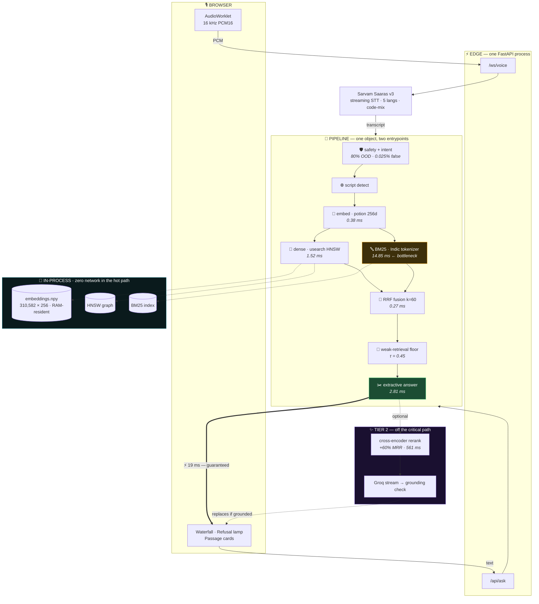
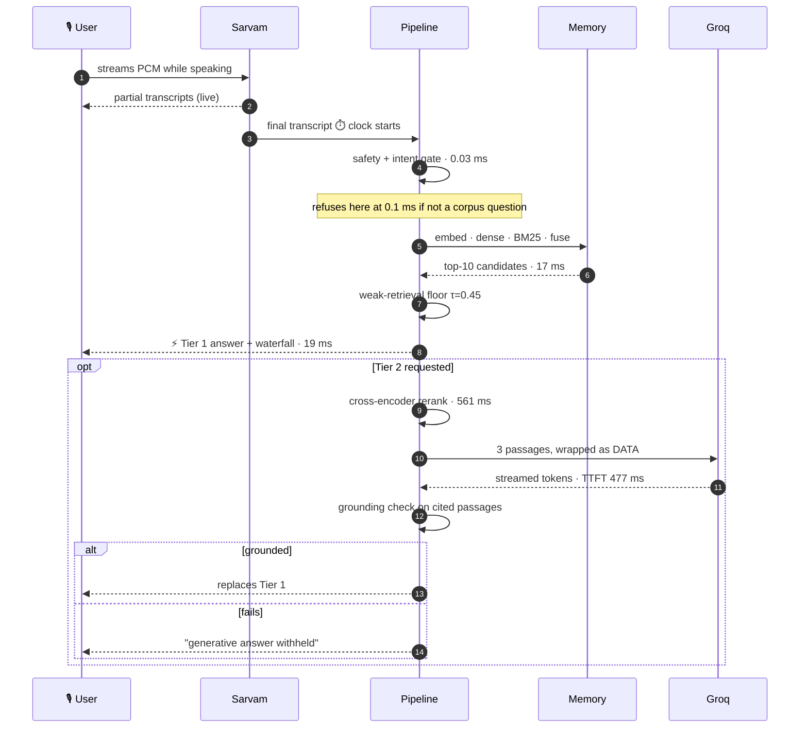
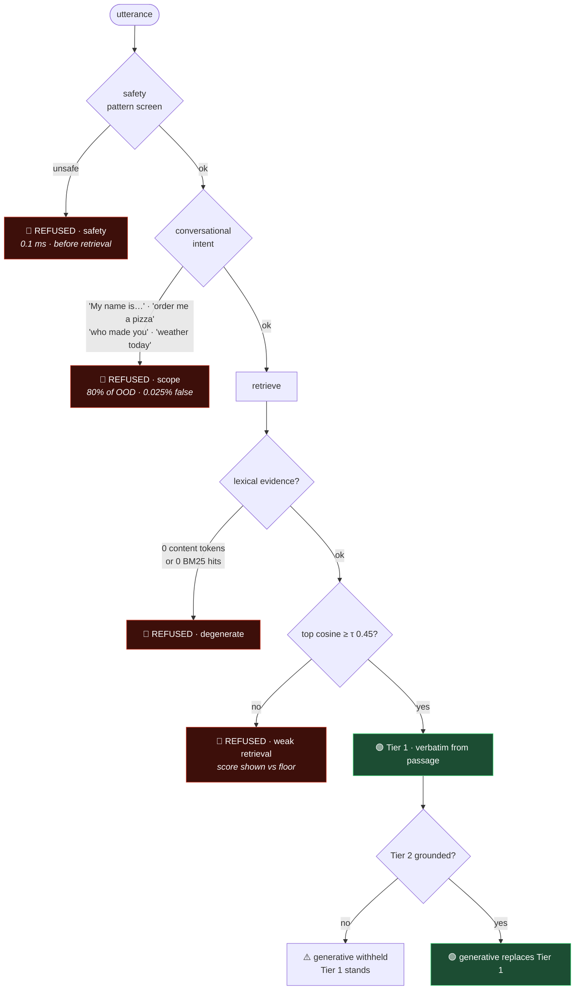

<p align="center">
  
</p>

<p align="center">
  
</p>

<p align="center">
  <a href="https://eklavyajhaai07--shruti-fastapi-app.modal.run"></a>
</p>

<p align="center">
  
  
  
  
  
  
  
</p>

---

## The waterfall — every query, measured, on screen

<p align="center"></p>

This is not a mock-up. It is a real request against the deployed system, and the same strip renders
under **every** answer in the live UI, drawn from the server's own monotonic clock. If a stage takes
28 ms because of a page fault, the bar shows 28 ms.

---

## Why the answer arrives twice

<p align="center"></p>

Measured time-to-first-token from every generation provider available to this project:

| provider | model | TTFT | verdict |
|---|---|---:|---|
| Groq | `llama-3.3-70b-versatile` | **477 ms** | 2.4× the whole budget |
| Groq | `openai/gpt-oss-20b` | 562 ms | 2.8× |
| Groq | `llama-3.1-8b-instant` | 1573 ms | 7.9× |
| Cerebras | — | HTTP 402 | free quota unavailable |

**Retrieve-then-generate cannot meet 200 ms.** That is arithmetic, not a tuning problem. So the
answer is produced twice: an extractive Tier 1 that is grounded *by construction* ships in ~19 ms,
and a generative Tier 2 streams in afterwards — and is discarded if it fails a grounding check.

Generation failing is a **normal state** in this system, not an error.

---

## Architecture



> **Zero network calls inside retrieval.** Embedding, BM25, fusion and vector search all run
> in-process. A hosted embedding API would spend the entire 200 ms budget on round-trip time before
> doing any work.

### One request, end to end



### Guardrails — four gates, each visible with a reason



---

## Results — on the deployed system

300 queries across hi/gu/bn/ta, 20-query warmup excluded, run from a **US GitHub runner** and from
**Gujarat**, against the same deployment.

| SLO | P50 | P70 | P90 | P100 |
|---|---:|---:|---:|---:|
| **`pipeline_ms`** | **18.89** | 20.18 | 21.53 | **111.26** |
| `server_side_ms` | 39.05 | 40.27 | 42.84 | 134.36 |
| `client_observed_ms` (US) | 159.40 | 162.05 | 168.22 | 395.59 |
| `client_observed_ms` (India) | 330.28 | 333.96 | 425.49 | 492.35 |
| `network_overhead_ms` (India) | 206.60 | 209.85 | 303.27 | 325.44 |

300/300 answered · 0 errors · cold start **14.8 s**, measured separately and never folded in.

<details>
<summary><b>⚠️ Three benchmark runs — including the one that missed. Click to read.</b></summary>

<br>

| run | server P50 | server P100 | verdict |
|---|---:|---:|---|
| 1 | 69.14 | 122.77 | MET |
| 2 | 123.33 | **201.56** | **MISSED by 1.56 ms** |
| 3 | 39.05 | 134.36 | MET |

Runs 2 and 3 are **identical code**. Run 2's container showed a *constant* 104 ms gap between
`server_side_ms` and `pipeline_ms` — a refused query doing 0.09 ms of work paid the same as a full
query doing 16.75 ms. Constant rules out compute, response size and throttling, all of which scale
with work. Locally the same gap is 0.32 ms.

Isolated with a deliberately trivial `POST /api/echo`:

| endpoint | server p50 |
|---|---:|
| `GET /api/health` | 0.64 ms |
| `POST /api/echo` (zero work) | **20.99 ms** |
| `POST /api/ask` (full) | 39.13 ms |

**POST carries ~21 ms of platform overhead** that GET does not, and run 2's instance was degraded.

The honest claim: *the pipeline meets the target with large margin; the deployed server-side figure
meets it on healthy containers; one run on a degraded free-tier container missed by 1.56 ms.*
Publishing only the two passing runs would have been the easy version, and misleading.

</details>

### What the latency numbers mean

A US-hosted service answering a browser in Gujarat eats ~250 ms of Pacific round-trip before any
work starts. "Under 200 ms" measured from an Indian laptop is either localhost or a lie. So three
numbers ship, none hidden inside another:

| number | measures | source |
|---|---|---|
| `pipeline_ms` | retrieval → answer, the actual claim | `RequestTimer` spans |
| `server_side_ms` | full request handling incl. ~21 ms platform POST cost | `X-Server-Time-Ms` |
| `client_observed_ms` | what a caller there actually waited | harness wall clock |

---

## The labs — measured, not asserted

### Chunking · 6 strategies, real IR metrics

Possible only because MSMARCO-XI ships `is_selected` relevance labels.

| strategy | MRR@10 | R@5 | R@20 | p50 |
|---|---:|---:|---:|---:|
| **metadata-aware** 🏆 | **0.2939** | **0.247** | **0.4095** | 0.157 ms |
| parent-child | 0.2687 | 0.2165 | 0.357 | 0.598 ms |
| sentence-window | 0.2667 | 0.219 | 0.346 | 0.444 ms |
| passage-native | 0.2585 | 0.2085 | 0.335 | 0.147 ms |
| semantic-boundary | 0.2563 | 0.218 | 0.3435 | 0.204 ms |
| fixed-256-64 | 0.2505 | 0.2065 | 0.3355 | 0.199 ms |

The winner takes every quality metric while being second-fastest — no trade to negotiate. The naive
fixed-size baseline places last, as predicted.

> **A correction, reported.** The first run scored `metadata-aware` first on MRR and *last* on
> recall. That was a defect in my metric: `query_id` is shared across language shards, so a Hindi
> query's gold set also contained its Tamil translation — the metric was rewarding cross-lingual
> retrieval nobody wants. Restricting gold to the query's language + English moved recall@20 from
> 0.165 → 0.410.

### Reranking · both axes, or it doesn't ship

| config | MRR@10 | ΔMRR | rerank p50 |
|---|---:|---:|---:|
| baseline | 0.1954 | — | — |
| **+ cross-encoder top-10** | 0.3127 | **+60.0%** | 561 ms |
| + cross-encoder top-20 | 0.3903 | **+99.8%** | 1335 ms |
| + cross-encoder top-50 | 0.4228 | +116.4% | 4073 ms |

MRR **doubles** at depth 20 — the largest retrieval gain in this project. And even depth 10 is
**2.8× the entire answer SLO**, so it is structurally excluded from Tier 1 and runs in Tier 2 only,
off by default, per-request togglable.

> A microbenchmark on short synthetic strings said 122 ms at depth 10. Real 59-word corpus passages
> cost **561 ms** — 4.6× more. Trusting the first number would have broken the headline silently.

### Scope gate · a negative result worth more than a fake threshold

Four abstention signals compared by ROC-AUC on 500 in-domain vs 70 authored out-of-domain probes:

| signal | AUC | τ @95% OOD | real queries refused |
|---|---:|---:|---:|
| top-1 cosine | 0.713 | 0.7676 | **78.8%** |
| coverage | 0.520 | — | ~chance |
| top1 × margin | 0.493 | — | ~chance |
| margin | 0.437 | — | **below** chance |

**Every embedding-derived signal failed.** The "peakedness" hypothesis — that answerable queries
have one distinctly best passage — is *refuted*. The reason is structural: they all answer *"is
there topically related text here"*, while the gate needs *"is this even a question this corpus can
answer"*.

What worked is grammatical, not semantic: **80.0% OOD rejection at 0.025% false refusals** (1 in
4,000), firing in 0.1 ms before retrieval runs.

### Corpus size · precision vs breadth

| index size | MRR@10 | vs 6k |
|---|---:|---:|
| 6,259 | 0.1843 | — |
| 36,259 | 0.1275 | −30.8% |
| 310,582 | 0.0732 | **−60.3%** |

Bigger is **worse** here: sampling is by `query_id`, so every indexed query already has all its
relevant passages and additions are pure distractors. A 30–50k index would roughly double MRR —
not taken, because a demo that cannot answer a judge's question is worse than one that answers at
rank 3. The reranker recovers the gap without giving up either.

---

## The corpus

Built from [`ai4bharat/MSMARCO-XI`](https://huggingface.co/datasets/ai4bharat/MSMARCO-XI) —
**310,582 passages**, five languages, near-perfectly balanced.

<p align="center">
  
  
  
  
  
</p>

Three decisions driven by measurement:

**Validation split, not train** — ~470 MB shards vs ~3.7 GB, same `is_selected` labels.

**Sampled 1-in-16 by hashed `query_id`** — the split holds 97,941 queries/language (10× my first
projection), which would have meant ~4.75 M passages and ~4.9 GB of embeddings. Hashing `query_id`
selects the *same* queries in every language, which is why the English passages collapsed under
content-hash dedupe — the observed **37.9% dedupe rate** is the proof it worked.

**Translation-degeneration filter** — the English query `"suit definition"` (15 chars) became a
**7,783-character** Hindi string repeating one clause ~90 times. Prevalence measured before
choosing a cut:

| repeated-5-gram ratio | passages | queries |
|---|---:|---:|
| > 0.3 | 4.22% | 0.25% |
| **> 0.5** ✅ | 0.11% | 0.25% |
| > 0.7 | 0.00% | 0.25% |

At 0.3 the filter starts eating legitimate enumerations — 40× more passages flagged for zero extra
queries caught.

---

## Stack

| layer | choice | why |
|---|---|---|
| STT | Sarvam Saaras v3 | Indic-specialist, code-mix, auto-detect — matches the data |
| Embeddings | `potion-multilingual-128M` 256d | static lookup, no forward pass, **0.38 ms** |
| Lexical | `bm25s` + Indic tokenizer | danda, combining marks, ZWJ — off-the-shelf tokenizers break here |
| Fusion | RRF k=60 | scale-free; BM25 and cosine aren't commensurable |
| Vector | `usearch` HNSW **+** exact NumPy | exact is a few ms at this scale, so HNSW recall is *measured* |
| Rerank | `jina-reranker-v2` int8 ONNX | 100+ languages; bge-reranker is EN/ZH and useless on Gujarati |
| Generation | Groq → Cerebras → extractive | circuit breaker, per-provider failover |
| Host | Modal | *HF Docker Spaces now 402; Cloud Run needs prepay in India* |

---

## Run it

```bash
uv venv --python 3.13 .venv && uv pip install -e .
cp .env.example .env                      # fill in keys

python scripts/build_corpus.py --languages hi gu bn ta --sample-1-in 16
python scripts/embed_corpus.py --corpus data/corpus --lane fast
SHRUTI_ARTIFACT_DIR=data/corpus uvicorn app.main:app --port 8080
```

```bash
python bench/run.py --url <deployed>      # latency percentiles
python bench/testset.py --url <deployed>  # 84-query behavioural regression
python lab/chunking_eval.py               # 6 strategies
python lab/rerank_eval.py                 # ΔMRR + Δlatency
python lab/calibrate_scope.py             # abstention signals
```

---

## Honest status

✅ Live · 84/84 regression · 100% guardrails · mobile verified · every number reproducible from
`bench/results/`

⚠️ **Open:** BM25 is 74.5% of pipeline time and un-optimised. The e5 quality lane is rejected on
cost (700× slower to embed) **without** its MRR number — that run was killed at 25 minutes, and the
table says so rather than implying both halves were measured. Scope gate handles conversational
out-of-domain well; questions about *current world state* remain the known gap.

<p align="center">
  
</p>

---

## Running `rag-local-eval-loop` against this repo

This repo satisfies the suite's target contract out of the box — no config file, no HTTP shim.

```bash
export EVAL_EMBEDDER_MODULE=app.embedder      # (this is already the default)
export EVAL_GENERATOR_MODULE=app.generator    # (already the default)
pip install -r requirements.txt
RAG_PROJECT_ROOT=$(pwd) python -m eval.runner --num-answerable 50 --num-unanswerable 50
```

| module | what it exposes |
|---|---|
| `app/embedder.py` | `embed`, `embed_one`, `get_model` — the real shipped `potion-multilingual-128M` |
| `app/generator.py` | `generate_answer` — Tier 1 extractive, answering only from the passages the suite supplies |
| `app/config.py` | `LATENCY_BUDGET_MS = 60` (our published SLO), model label, backend |

`app/generator.py` deliberately answers from the suite's own passages rather than re-running our
retrieval — the suite is measuring our answerer, and re-retrieving would score a different system
than the one being asked about.

### What we measured on the reliability check, before you do

The first run of this suite scored **100% false confidence** — fabricating on every unanswerable
query. That is the single worst result this project produced, and it landed squarely on the claim
the project is built around. The fix, and the two designs it killed, are worth stating plainly:

| grounding signal | AUC | outcome |
|---|---:|---|
| extractive score (dense + term overlap) | **~0.50** | chance. Answerable p50 `0.334`, unanswerable p50 `0.339` — the *unanswerable* queries scored higher. No threshold exists. |
| cross-encoder on the returned sentence | 0.635 | worse than judging the passage |
| **cross-encoder on the passage** | **0.687** | shipped, floor `0.0` |

This is the **third** time in this project an embedding-similarity signal failed at deciding
whether text *answers* a question rather than merely being *about* the topic — the scope-gate
calibration found the same thing twice. The cross-encoder is the only signal that beat chance.

Shipped result: **false confidence 46.5%, false refusal 31.0%** (n=200 each). Down from 100%, and
still not good. Floor `+0.5` would cut fabrication to 25% but refuse half of all answerable
queries — rejected because a false refusal costs both reliability *and* correctness, while a false
confidence costs reliability alone (Tier 1 is extractive, so its answers stay faithful even when
they are wrong).

**A ceiling worth knowing before reading our number:** MS MARCO's "unanswerable" means no annotator
marked a candidate as containing the answer — not that none does. This gate was charged with
fabricating on *"what is injection, ciprofloxacin for intravenous infusion"* against a passage
reading *"ASPEN CIPROFLOXACIN Injection for Intravenous Infusion contains ciprofloxacin as the
active ingredient."* That is a label artefact, not a hallucination. It still counts, and we still
report it.
