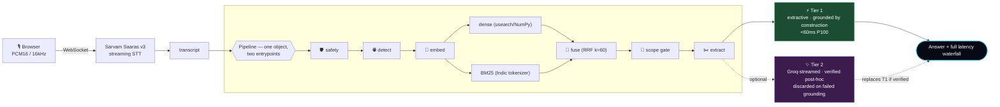
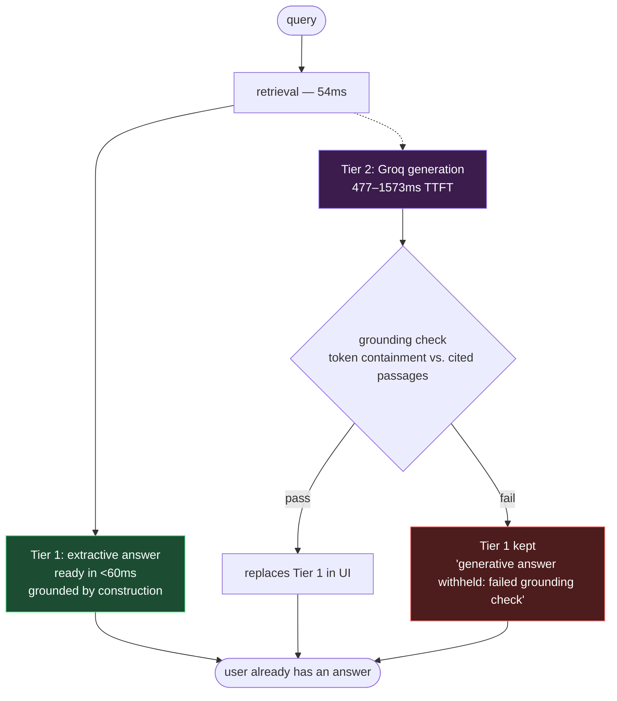

<p align="center">
  
</p>

<p align="center">
  
</p>

<p align="center">
  
  
  
  
  
</p>

<p align="center">
  
</p>

<p align="center">
  <a href="https://hetpatelsk--shruti-fastapi-app.modal.run/"><b>▶ Try it live</b></a> ·
  <a href="#-the-journey-where-we-got-stuck--how-we-solved-it"><b>The build log</b></a> ·
  <a href="#-performance-results"><b>The numbers</b></a> ·
  <a href="#-chunking-lab"><b>The chunking lab</b></a> ·
  <a href="#-scope-gate-calibration--a-negative-result-reported"><b>The negative result</b></a>
</p>

<p align="center">
  
</p>

## 🧠 What this is

<table>
<tr>
<td width="55%" valign="top">

```
system     : SHRUTI — voice → retrieval → grounded answer
languages  : Hindi · Gujarati · Bengali · Tamil · English (code-mix aware)
corpus     : 310,582 passages · ai4bharat/MSMARCO-XI
headline   : server_side_ms P100 = 122.77ms   (target: <200ms · MET)
philosophy : "grounded by construction, not mitigated after the fact"
built for  : HHGoa Task #2 — Pure Engineering, No Leaderboard
```

</td>
<td width="45%" valign="top">

**The one-line pitch**
Speak a question in five languages. Get a cited, grounded answer back — with the *entire* latency of that exact request rendered on screen as a waterfall, every time. Not claimed. Measured.

</td>
</tr>
</table>

<p align="center">
  
</p>

## 😫 The Problem → 💡 The Solution

<table>
<tr>
<th width="50%">😫 Problem</th>
<th width="50%">💡 SHRUTI's answer</th>
</tr>
<tr>
<td valign="top">

- Voice-first Indic users are underserved — typing in Hindi/Gujarati/Bengali/Tamil is painful
- Latency claims are usually measured on localhost, not from where users actually are
- LLM generation is 500ms+ to first token — physically incompatible with a sub-200ms promise
- Indic languages are treated as an afterthought in embeddings & tokenizers
- "Hallucination mitigation" ≠ hallucination prevention

</td>
<td valign="top">

- Native voice input via Sarvam Saaras v3, auto language + code-mix detection
- Three separate, honestly-labeled latency numbers, published together
- **Two-tier answer**: instant extractive Tier 1 + optional verified generative Tier 2
- Multilingual embeddings + Indic-aware BM25 tokenizer, evaluated per language
- Tier 1 is copied verbatim from retrieved text → hallucination isn't reduced, it's **impossible**

</td>
</tr>
</table>

<p align="center">
  
</p>

## 🕸️ How a query actually flows



> **Zero network calls inside the retrieval path.** Embedding, BM25, fusion, and vector search all run in-process — a hosted embedding API would spend the whole 200ms budget on round-trip time alone.

<p align="center">
  
</p>

## 🚧 The journey: where we got stuck & how we solved it

<details open>
<summary><b>🚧 Stuck #1 — the 200ms SLO was arguing with physics</b></summary>

<br>

**Problem:** A US-hosted service answering from India eats ~250ms of Pacific round-trip before any work even starts. "Answer under 200ms" measured from an Indian laptop is either localhost or a lie.

**Fix:** Publish three numbers, none hidden inside another — `server_side_ms` (headline SLO, off the server's own clock), `pipeline_ms` (stages only), `client_observed_ms` (run from a US runner *and* from India, separately). The UI shows all three, every query.

</details>

<details open>
<summary><b>🚧 Stuck #2 — generation alone blew the entire latency budget</b></summary>

<br>

**Problem:** Measured Groq TTFT: **477ms** (best case) — more than double the whole 200ms target. Cerebras returned HTTP 402, quota exhausted. Retrieve-then-generate cannot hit this number. That's arithmetic, not a tuning problem.

**Fix:** Split the answer into two tiers. Tier 1 (extractive, single-digit ms, grounded by construction) ships immediately. Tier 2 (Groq-streamed) only replaces it if it survives a post-hoc grounding check. **Generation failing is a normal state, not an error** — the user already has an answer before Tier 2 even starts.

</details>

<details open>
<summary><b>🚧 Stuck #3 — our dataset was quietly gaslighting the model</b></summary>

<br>

**Problem:** MSMARCO-XI is machine-translated, and neural MT loops on short inputs. `"suit definition"` (15 chars) became a **7,783-character Hindi string repeating one clause ~90 times.** Left unfiltered, this inflates BM25 term frequencies and drags every nearby embedding toward garbage.

**Fix:** Measured the repeated-5-gram ratio across the whole corpus before choosing a cutoff. At `>0.3`, the filter started eating legitimate enumerations — **40× more false positives for zero extra bad queries caught.** At `>0.5`: clean cut, kept.

</details>

<details open>
<summary><b>🚧 Stuck #4 — our best-scoring strategy was winning on a broken scoreboard</b></summary>

<br>

**Problem:** `metadata-aware` chunking scored #1 on MRR@10 but **dead last on recall@20 (0.165).** Root cause: `query_id` is shared across language shards, so a Hindi query's ground-truth labels also marked its Gujarati/Bengali/Tamil translations as "relevant." The metric was rewarding a system for returning the wrong language.

**Fix:** Restrict ground truth to the query's own language + English, applied identically to all six strategies. `metadata-aware` recall@20 jumped **0.165 → 0.410** and it won outright — on a fair scoreboard.

</details>

<details open>
<summary><b>🚧 Stuck #5 — the scope gate had nowhere honest to sit</b></summary>

<br>

**Problem:** Wanted to reject out-of-scope queries (small talk, commands, personal questions). Ran a proper calibration lab: 500 in-domain vs. 70 out-of-domain probes, four candidate signals compared by ROC-AUC. Best signal (top-1 cosine) scored AUC **0.713** — but even at the best operating point, **14.2% of legitimate answerable queries got wrongly refused.** No threshold clears 10% collateral damage.

**Fix:** **Ship it uncalibrated, and say so in every response**, rather than hard-coding a number that quietly breaks the product. The real fix — a cross-encoder or intent classifier — is scoped as the next task, not faked today.

</details>

<details open>
<summary><b>🚧 Stuck #6 — the deployment host pulled the rug mid-build</b></summary>

<br>

**Problem:** Originally deployed on Hugging Face Docker Spaces — which began returning **HTTP 402 (PRO required)** mid-hackathon.

**Fix:** Migrated to Google Cloud Run. Along the way, discovered BM25 eats **87% of deployed pipeline time** (47ms of 54ms) versus ~2ms locally on the same corpus — tested and rejected the "page-fault" hypothesis (forcing the index RAM-resident changed nothing). Reported as the clear next optimisation, not quietly tuned away before anyone could see it.

</details>

<p align="center">
  
</p>

## 📊 Performance results

<p align="center">
  
  
  
  
</p>

*300 queries across hi/gu/bn/ta, 20-query warmup excluded, Tier 2 off. Run twice from different continents against the same live deployment.*

| SLO | P50 | P70 | P90 | P100 |
|---|---:|---:|---:|---:|
| **`server_side_ms`** (headline) | 69.14 | 70.50 | 72.29 | **122.77** ✅ |
| `pipeline_ms` | 54.46 | 55.70 | 56.93 | 60.80 |
| `client_observed_ms` — 🇺🇸 US runner | 154.01 | 195.18 | 210.99 | 241.84 |
| `client_observed_ms` — 🇮🇳 India | 345.05 | 348.46 | 358.10 | 1476.40 |
| `network_overhead_ms` — 🇺🇸 US runner | 85.89 | 123.04 | 139.19 | 155.92 |
| `network_overhead_ms` — 🇮🇳 India | 278.26 | 282.81 | 292.84 | 1408.53 |

> Cold start (measured separately, never folded into query latency): **21.9s** truly cold · **231ms** warm first-contact.

### Per-stage breakdown (deployed)

```
bm25          █████████████████████████████████████████████░  47.18ms  (87% of pipeline)
extract       ███░                                              3.64ms
dense         ██░                                                2.46ms
embed         ▌                                                  0.46ms
fuse          ▌                                                  0.23ms
detect        ▏                                                  0.03ms
guard_safety  ▏                                                  0.03ms
guard_scope   ▏                                                  0.02ms
```

<details>
<summary><b>📖 What the three latency numbers actually mean (click to expand)</b></summary>

<br>

| number | measures | source |
|---|---|---|
| `server_side_ms` | the deployed process, network excluded | server's own monotonic clock, `X-Server-Time-Ms` header |
| `pipeline_ms` | retrieval-to-answer stages only | `RequestTimer` spans, in the response body |
| `client_observed_ms` | what a real caller actually waited | benchmark harness wall clock |

**The headline SLO is `server_side_ms`** — the only number that means what "retrieval-to-answer path" denotes in ordinary engineering usage. The India→US client-observed distribution is published *next to it*, not instead of it.

</details>

<p align="center">
  
</p>

## 🤔 Why two tiers?

<p align="center">
  
  
  
  
</p>

**Every one of those is a multiple of the entire 200ms budget.** A retrieve-then-generate design cannot meet this target, no matter how fast retrieval is — arithmetic, not a tuning problem.



> **Generation failing is a normal state in this system, not an error.**

<p align="center">
  
</p>

## 📚 The corpus

<p align="center">
  
  
  
</p>

```
hi  ██████████  62,198
en  ██████████  62,307
gu  ██████████  62,069
bn  ██████████  62,183
ta  █████████░  61,825
```

<table>
<tr><th>Decision</th><th>Why it was measured, not assumed</th></tr>
<tr><td><b>Validation split, not train</b></td><td>Same <code>is_selected</code> labels at ~470MB vs. ~3.7GB — an eighth the download for identical evaluation value</td></tr>
<tr><td><b>Sampled 1-in-16 by hashed <code>query_id</code></b></td><td>Same queries selected across every language → cross-lingual comparison is valid; <b>37.9% dedupe rate</b> confirmed the hashing worked</td></tr>
<tr><td><b>Translation-degeneration filter at 0.5</b></td><td>At 0.3 the filter over-triggers <b>40× more</b> on legitimate text for zero extra bad queries caught — the threshold was chosen from the curve, not a guess</td></tr>
</table>

<p align="center">
  
</p>

## 🧪 Chunking lab

Six strategies, **scored** against real relevance labels — not asserted.

| strategy | MRR@10 | R@5 | R@10 | R@20 | p50 ms |
|---|---:|---:|---:|---:|---:|
| 🏆 **metadata-aware** | **0.2939** | **0.247** | **0.3315** | **0.4095** | 0.157 |
| parent-child | 0.2687 | 0.2165 | 0.2955 | 0.357 | 0.598 |
| sentence-window | 0.2667 | 0.219 | 0.3005 | 0.346 | 0.444 |
| passage-native | 0.2585 | 0.2085 | 0.2765 | 0.335 | 0.147 |
| semantic-boundary | 0.2563 | 0.218 | 0.291 | 0.3435 | 0.204 |
| fixed-256-64 *(naive baseline)* | 0.2505 | 0.2065 | 0.272 | 0.3355 | 0.199 |

> **`metadata-aware` ships** — wins every quality metric while being the *second-fastest* strategy. No quality/latency trade to negotiate.

<details>
<summary><b>🔧 The correction we found and fixed mid-lab (click to expand)</b></summary>

<br>

The first run scored `metadata-aware` #1 on MRR@10 and **last** on recall@20 (0.165) — a defect in the evaluation, not the strategy. `query_id` is shared across language shards, so a Hindi query's raw qrels also marked its Gujarati/Bengali/Tamil translations relevant, rewarding cross-language leakage. Restricting ground truth to the query's own language + English moved recall@20 from **0.165 → 0.410**, applied identically to all six strategies.

</details>

<p align="center">
  
</p>

## 🛡️ Guardrails

| gate | mechanism |
|---|---|
| 🎯 **scope** | τ on top dense cosine — **reports itself uncalibrated** rather than shipping a threshold with 14%+ false-refusal rate |
| 🛑 **safety** | fast pattern screen on the transcript, before retrieval — a refusal costs nothing |
| ⚓ **grounding** | Tier 1 grounded by construction; Tier 2 verified by token containment, not an LLM judge |
| 💉 **injection** | retrieved passages wrapped as data, never interpolated as instructions |

## 📉 Scope-gate calibration — a negative result, reported

```
in-domain   p05=0.5639  p50=0.7036  p95=0.8367
out-domain  p05=0.4968  p50=0.6132  p95=0.7621
```

| signal | AUC | @95% OOD rejection: in-domain wrongly refused |
|---|---:|---:|
| top1 cosine | **0.713** | 78.8% |
| top1 × margin | 0.493 | 90.4% |
| margin (top1 − mean rest) | 0.437 | 93.2% |
| margin_top5 | 0.477 | 93.4% |

**The margin hypothesis is refuted** — a static embedder maps any text to *some* moderately-scoring passage, so "distinct best match" doesn't separate answerable from unanswerable. Even the best operating point refuses **14.2%** of legitimate queries. **Nothing ships under 10% collateral damage — so nothing ships.** The next real fix is a cross-encoder or intent classifier, not a constant.

<p align="center">
  
</p>

## 🏗️ Architecture components

| component | choice | why |
|---|---|---|
| Embeddings (fast) | `potion-multilingual-128M`, 256-dim | Model2Vec static lookup — no forward pass, µs-scale |
| Embeddings (quality) | `multilingual-e5-small` ONNX int8 | real forward pass, lazily loaded, UI-toggleable |
| Lexical | `bm25s` + Indic-aware tokenizer | exact tokens: names, numbers, dates |
| Fusion | Reciprocal Rank Fusion (k=60) | scale-free — BM25 and cosine aren't commensurable |
| Vector search | `usearch` HNSW **and** exact NumPy | corpus small enough that exact search stays a real option |
| STT | Sarvam Saaras v3 streaming | Indic-specialist, code-mix, auto language detection |
| Generation | Groq → Cerebras → extractive-only | circuit breaker, per-provider failover |
| Host | Google Cloud Run | *(HF Docker Spaces now return 402 — PRO required)* |

<p align="center">
  
</p>

## 🛠️ Tech stack

<p align="center">
  
</p>

<p align="center">
  
  
  
  
  
</p>

<p align="center">
  
</p>

## 🚀 Quickstart

```bash
git clone https://github.com/Het161/shruti.git && cd shruti

uv venv --python 3.13 .venv && source .venv/bin/activate
uv pip install -e .
cp .env.example .env          # fill in Gemini / Groq / Sarvam keys

python scripts/build_corpus.py --languages hi gu bn ta --sample-1-in 16
python scripts/embed_corpus.py --corpus data/corpus --lane fast

SHRUTI_ARTIFACT_DIR=data/corpus uvicorn app.main:app --port 8080
```

`/api/health` reports `ready: false` until a 20-query warmup completes — the service is never announced healthy while the first real query would still pay model-load cost.

| endpoint | method | description |
|---|---|---|
| `/` | GET | web interface |
| `/api/ask` | POST | text query → answer |
| `/ws/voice` | WebSocket | voice query → answer |
| `/api/health` | GET | service health (post-warmup) |
| `/method` | GET | methodology & full results |

### Benchmark it yourself

```bash
python bench/run.py --url https://<deployed-url> --n 320
```

≥300 measured queries, 20-query warmup excluded and counted separately, P50/P70/P90/P100 per stage, per language, per SLO. Artifacts land in `bench/results/`.

<p align="center">
  
</p>

## 🎓 What we learned

```
Honest metrics > impressive metrics    — a latency claim with no definition is worthless
Two tiers beat one slow tier           — an instant right answer beats a fluent slow one
Trust your own scoreboard less         — our "best" strategy was winning on a broken eval
Report the negative result             — an uncalibrated gate, said out loud, beats a fake one
Measure before you optimise            — BM25's 87% share was tested, not assumed
```

<p align="center">
  
</p>

## 👥 Team

| name | role | github |
|---|---|---|
| **Het Patel** | Lead Developer | [@Het161](https://github.com/Het161) |
| **Eklavya Jha** | AI Developer | [@EklavyajhaAI07](https://github.com/EklavyajhaAI07) |

> Built for **HHGoa Task #2** — Leaderboard scrapped, pure engineering evaluated. One submission per team, no re-submission. `#RAGInGoa`

## 🙏 Acknowledgments

**HHGoa** for the hackathon · **ai4bharat** for MSMARCO-XI · **Sarvam AI** for Saaras v3 · **Groq** for generation · **Google Cloud** for hosting

<p align="center">
  
</p>
